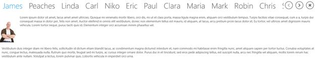

# Getting Started

This section explains how to create a high level tab navigation using `SfTabControl` control.

## Adding SfTabControl control

Create a Universal Windows Platform project in Visual Studio and refer to the following assemblies.

1. Syncfusion.SfTabControl.UWP
2. Syncfusion.SfShared.UWP

1.Include the namespace for Syncfusion.SfTabControl.UWP assembly in MainPage.xaml





<Page xmlns="http://schemas.microsoft.com/winfx/2006/xaml/presentation"

xmlns:x="http://schemas.microsoft.com/winfx/2006/xaml"

xmlns:navigation="using:Syncfusion.UI.Xaml.Controls.Navigation">





2.Now add the SfTabControl control with a required optimal name using the included namespace





<navigation:SfTabControl x:Name="tabControl">





  SfTabControl tabControl = new SfTabControl();





   Dim tabControl As New SfTabControl()





### Implement Model and ViewModel properties

Each tile view item, require `Content` and `MaximizedContent` property to be set. For coding simplicity, ItemsSource binding is used in this example.

1.Define the properties required in Model class:





public class Person

    {
		
        public string Name { get; set; }
		
        public string Image { get; set; }
		
        public Person(string name, string image)
		
        {
			
            Name = name;
			
            Image = image;
			
        }
		
    }





Public Class Person

		Public Property Name() As String

		Public Property Image() As String

		Public Sub New(ByVal name As String, ByVal image As String)

			Me.Name = name

			Me.Image = image

		End Sub

End Class





2. Define and populate the collection in ViewModel class:





public class TabControlViewModel : NotificationObject

    {
		
        public TabControlViewModel()
		
        {
			
            TabControlItems = new ObservableCollection<Person>();
			
            TabControlItems.Add(new Person("James", "Assets/1.jpg"));
			
            TabControlItems.Add(new Person("Peaches", "Assets/2.jpg"));
			
            TabControlItems.Add(new Person("Linda", "Assets/3.jpg"));
			
            TabControlItems.Add(new Person("Carl", "Assets/4.jpg"));
			
            TabControlItems.Add(new Person("Niko", "Assets/5.jpg"));
			
            TabControlItems.Add(new Person("Eric", "Assets/Employee2.png"));
			
            TabControlItems.Add(new Person("Paul", "Assets/Employee4.png"));
			
            TabControlItems.Add(new Person("Clara", "Assets/Employee6.png"));
			
            TabControlItems.Add(new Person("Maria", "Assets/Employee11.png"));
			
            TabControlItems.Add(new Person("Mark", "Assets/Employee13.png"));
			
            TabControlItems.Add(new Person("Robin", "Assets/Employee16.png"));
			
            TabControlItems.Add(new Person("Chris", "Assets/Employee21.png"));
			
            TabControlItems.Add(new Person("James", "Assets/Employee23.png"));
			
            TabControlItems.Add(new Person("Mathew", "Assets/Employee25.png"));
			
        }

        private ObservableCollection<Person> items;
		
        public ObservableCollection<Person> TabControlItems
		
        {
			
            get { return items; }
			
            set { items = value; }
			
        }
		
    }





Public Class TabControlViewModel
	Inherits NotificationObject

		Public Sub New()

			TabControlItems = New ObservableCollection(Of Person)()

			TabControlItems.Add(New Person("James", "Assets/1.jpg"))

			TabControlItems.Add(New Person("Peaches", "Assets/2.jpg"))

			TabControlItems.Add(New Person("Linda", "Assets/3.jpg"))

			TabControlItems.Add(New Person("Carl", "Assets/4.jpg"))

			TabControlItems.Add(New Person("Niko", "Assets/5.jpg"))

			TabControlItems.Add(New Person("Eric", "Assets/Employee2.png"))

			TabControlItems.Add(New Person("Paul", "Assets/Employee4.png"))

			TabControlItems.Add(New Person("Clara", "Assets/Employee6.png"))

			TabControlItems.Add(New Person("Maria", "Assets/Employee11.png"))

			TabControlItems.Add(New Person("Mark", "Assets/Employee13.png"))

			TabControlItems.Add(New Person("Robin", "Assets/Employee16.png"))

			TabControlItems.Add(New Person("Chris", "Assets/Employee21.png"))

			TabControlItems.Add(New Person("James", "Assets/Employee23.png"))

			TabControlItems.Add(New Person("Mathew", "Assets/Employee25.png"))

		End Sub

		Private items As ObservableCollection(Of Person)

		Public Property TabControlItems() As ObservableCollection(Of Person)

			Get
				Return items
			End Get

			Set(ByVal value As ObservableCollection(Of Person))
				items = value
			End Set

		End Property

End Class





## Design view for content 

Set the property `TabScrollButtonVisibility` property to Visible for enabling the scroll buttons. Bind the view model collection to `ItemSource` property and design the template for content as given below.





<Navigation:SfTabControl x:Name="tabControl" SelectedIndex="0"
                         DisplayMemberPath="Name"
						 ItemsSource="{Binding TabControlItems}"
						 TabScrollButtonVisibility="Visible">
						 
<Navigation:SfTabControl.ContentTemplate>

<DataTemplate>

<Grid>

<Grid.ColumnDefinitions>

<ColumnDefinition Width="Auto"/>

<ColumnDefinition Width="*"/>

</Grid.ColumnDefinitions>

<Grid.RowDefinitions>

<RowDefinition Height="Auto"/>

<RowDefinition />

</Grid.RowDefinitions>

<Grid Margin="0 10">

<Image Source="{Binding Image}" Height="140"
       VerticalAlignment="Top" Stretch="Uniform"/>
	   
</Grid>

<RichTextBlock Grid.Column="1" Margin="10">

<Paragraph>

<Run FontSize="18">

    TabItem contain the details of Employee in TabControl.

</Run>

</Paragraph>

</RichTextBlock>

</Grid>

</DataTemplate>

</Navigation:SfTabControl.ContentTemplate>

</Navigation:SfTabControl>





