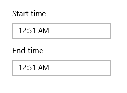

# Overview

The SfTimePicker control allows the user to select time values in a touch friendly manner.

### Normal view

### Expanded view

###Key Features

Formatting – The control displays the selected time value in a various formats.

